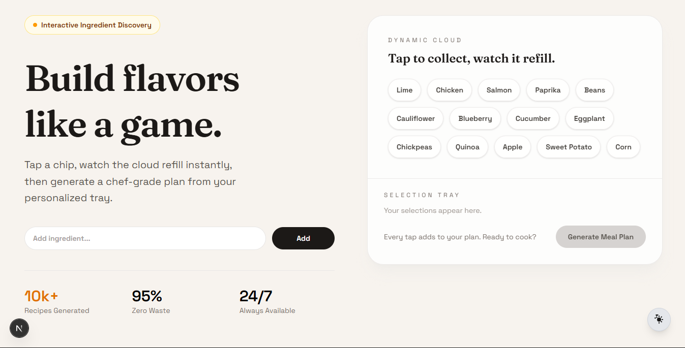

#  AI Chef Assistant

AI Chef Assistant is a smart web application that helps users generate personalized meal plans based on their preferences, ingredients, or dietary goals. It leverages AI to provide structured recipes, meal suggestions, and a smooth user experience.

<a href="https://ai-chef-assistant-tau.vercel.app/" target="_blank">
  
</a>


## ✨ Features

- 🍽️ Generate personalized meal plans  
- 🧠 AI-powered recipe suggestions  
- ⚡ Fast and responsive UI  
- 🎯 Custom inputs (ingredients)  
- 📱 Mobile-friendly design  
- 🌙 Light/Dark mode support  


## 🛠️ Tech Stack

- Frontend: Next.js, React, TypeScript  
- Styling: Tailwind CSS  
- Deployment: Vercel  
- AI Integration: OpenAI / AI API  


## ⚙️ Installation & Setup

### 1. Clone the repository
```bash
git clone https://github.com/BellilxDhaker/ai-chef-assistant.git
```

### 2. Navigate to the project directory
```bash
cd ai-chef-assistant
```

### 3. Install dependencies
```bash
npm install
```

### 4. Run the development server
```bash
npm run dev
```

### 5. Open in browser
```
http://localhost:3000
```


## 📦 Build for Production

```bash
npm run build
```

```bash
npm start
```


## 🚀 Deployment

This project is deployed on Vercel. Any push to the main branch will trigger automatic deployment.


## 🚀 Live Demo

👉 https://ai-chef-assistant-tau.vercel.app/


## 📄 License

MIT License
